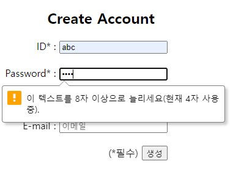

# 게시판 만들기 미니 프로젝트

## 프로젝트 소개
Spring Boot를 사용하여 회원 기능이 있고 기본적인 Create, Read, Update, Delete 기능을 가진 게시판을 구현한 간단한 프로젝트입니다.

### 프로젝트 기간
2022.10.27 ~ 2022.10.28

### 참여 인원
[RynuRen](https://github.com/RynuRen)

### 사용 기술

  
  
  
  
  
  
  

### 개발 환경
Windows10, JDK11, vscode, MariaDB, Spring Boot(v2.6.13), maven, myBatis, thymeleaf, thymeleaf-layout, Lombok

## 구상
지금까지 배운 account관련 기능들과 게시판 관련 기능들을 기본으로 평소에 쓰던 게시판들을 생각하며 있어야 할 기능들을 하나씩 추가해 보기로 했습니다. 특히 게시판 리스트의 페이지네이션 구현으로 향후 비슷한 프로젝트를 진행할 경우 참고할 수 있을 것입니다.

## ERD

# 구현
우선 기초적인 레이아웃을 짜서 페이지를 이동해도 통일감을 주도록 했습니다. 그다음 계정관련 기능들을 구현하고 이를 바탕으로 마지막으로 게시판 관련 코딩을 진행했습니다.

## 1) 레이아웃

thymeleaf-layout을 써서 일반적인 웹들을 생각해서 탑에 네비메뉴를 넣고 가운데에 컨텐츠를 보여주는 식으로 구상했습니다.

### top 페이지
이 구역은 네비게이션 구역으로 메인링크과 하나밖에 추가하지 못한 게시판 링크를 가운데로 두고 우측에는 계정 관련 링크들을 배치했습니다.

로그인 세션의 유무에 따라 없다면 '로그인 | 계정생성'을, 있다면 '로그아웃 | 정보수정'이 표시되도록 구현했습니다.

### bottom 페이지
생각나는게 없어서 우선 Copyrigh만 넣어 뒀는데 끝까지 추가할 사항이 없었습니다.

---
## 2) 계정 관련
계정에 필요한 데이터는 데이터를 식별할 userId를 primary값으로 했고, 추가로 비밀번호, 별명, 이메일, 계정 생성일을 데이터 값으로 정했습니다.

### 계정생성
계정 생성 페이지에서 form태그의 input태그에 type속성을 각각 다르게 설정해서 입력받을 값을 지정했습니다.

비밀번호는 타입을 password로 해서 입력을 가렸고 minlength 속성도 8로 추가해 8자리 이상을 받도록 했습니다.

이메일은 타입을 email로 해서 입력받을 때 @양쪽으로 문자가 있는지 체크하게 했습니다.

필수적으로 입력받을 아이디, 비밀번호, 닉네임에는 required 속성을 추가해 반드시 값을 입력받도록 했습니다. 이로써 null 데이터를 db에 등록하는 것을 막을 수 있었습니다.

계정생성일을 기록하기 위해 value에 마지막으로 now()를 추가해 줬습니다.

### 로그인
계정 생성에 사용한 것을 응용해서 아이디와 비밀번호에 null을 입력해 예외가 발생할 수 있는 상황을 피할 수 있었습니다.

### 정보수정

아이디는 수정할 수 없게 readonly 속성을 주고 비밀번호를 제외한 닉네임과 이메일은 해당 세션의 유저정보에서 읽어와 보여주고 수정도 가능하게 했습니다. 수정을 하려면 현재 비밀번호에 맞는 비밀번호를 입력해야 하고 비밀번호를 변경하고자 할 때에는 바꿀 비밀번호 칸에 입력하면 쿼리를 통해 DB상에도 수정되도록 했습니다. 가장 아래쪽에는 계정을 생성한 날짜를 보여줬습니다.

## 3) 게시판 관련
게시글의 데이터는 데이터를 구별할 고유id와 제목, 내용, 작성자, 작성자를 구별할 작성자id, 작성일, 수정일, 조회수, 추천, 비추천으로 정했습니다. 추가로 DB에서 불러올 때 매길 row number를 저장할 필드도 선언해 뒀습니다. (시간이 부족해 추천과 비추천은 구현하지 못했습니다.)

### 게시글 리스트

게시글의 id와는 다른, 쿼리의 결과로 숫자가 붙여진 필드와 제목, 작성자(별명), 작성일, 조회수, 추천 데이터만 가져와 리스트를 보여 줬습니다. 제목에는 해당 게시글로 갈 수 있는 하이퍼링크를 달았습니다.

작성일의 경우 게시글이 오늘 작성되었다면 시:분으로 표시되고, 아니라면 월, 일만 표시되도록 했습니다.

여기서 한가지 문제가 있었는데, DB에서 시간을 불러올 때 웹에서는 다른시간으로 나타났습니다. 이는 서버시간 문제로 application.properties에서 서버시간을 Asia/Seoul로 변경해줬습니다.

페이지네이션 구현은 BoardController.java에서 구현했습니다. MariaDB에서 RowNum을 지원하지 않아 변수를 지정하는 쿼리문을 작성해 LIMIT를 이용, 오래된 게시글부터 번호를 매겨 설정에 맞는 범위의 게시글만 가져오게 구현했습니다. 물론 html에서도 페이지번호가 맞게 순환되도록 구현했습니다.

세션에 유저가 없으면 글쓰기 버튼은 비활성화 되도록 했습니다.

### 게시글 작성

글을 작성할 때도 마찬가지로 작성시간을 넣기위해 쿼리문을 작성했습니다.

### 게시글 조회

게시글 조회 메서드를 호출 할 때마다 DB상의 해당 게시글의 view를 1씩 증가시키도록 했습니다. 작성내용에 줄바꿈을 표시해주지 못하는 문제가 있어 html style에 word-break:break-all를 추가해줬습니다.

### 게시글 수정

수정 완료 시 해당 시점의 시간을 DB로 넘겨 수정일로 지정했습니다.

### 게시글 삭제

boardId를 기준으로 게시글의 삭제 정보 colunm인 boardDel의 값을 1으로 변경해 실제 DB상에는 남아있지만 사용자에게 노출을 시키지 않도록 했습니다.

해당 페이지의 번호는 DB에서 쿼리를 할 때 rownum로 얻은 값으로 boardId와는 다른 값입니다.

# 개선점
* API 명세서 작성
* 회원가입시 아이디 중복체크 기능
* 한 화면에 출력될 페이지 수와 한 페이지에 출력할 게시글 수를 유저가 설정가능
* 게시글 상세페이지를 새로고침 할 때마다 조회수가 증가하는 문제

# 추가하고 싶은 점
* 추천, 비추천 기능
* 덧글 기능
* 관리자 계정
